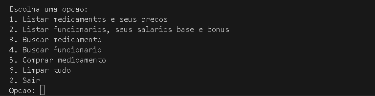

<div align="center">

# Miniprojeto Farmácia Java
</div>

## Descrição
Este projeto é uma aplicação Java para gerenciar uma farmácia. Ele permite listar medicamentos, gerenciar estoque, registrar compras e calcular bônus para funcionários com base no lucro acumulado.

## Funcionalidades
- Listar medicamentos e seus preços.
- Listar funcionários e seus bônus.
- Comprar medicamentos, atualizando o estoque e o lucro da farmácia.
- Calcular bônus para funcionários a cada 30 reais de lucro acumulado.

## Estrutura do Projeto
- `src/`: Contém os arquivos de código-fonte `.java`.
- `bin/`: Contém os arquivos `.class` compilados.

## Requisitos
- Java 8 ou superior.

## Instalação
1. Clone o repositório:
    ```sh
    git clone https://github.com/geanemr/miniprojeto-farmacia-java.git
    ```
2. Navegue até a raiz do projeto:
    ```sh
    cd miniprojeto-farmacia-java
    ```
3. Execute o projeto:
    ```sh
    java -cp bin Main
    ```

## Menu Interativo no Prompt
Após executar o projeto, você verá o seguinte menu interativo no terminal. Basta selecionar a opção desejada para iniciar.


